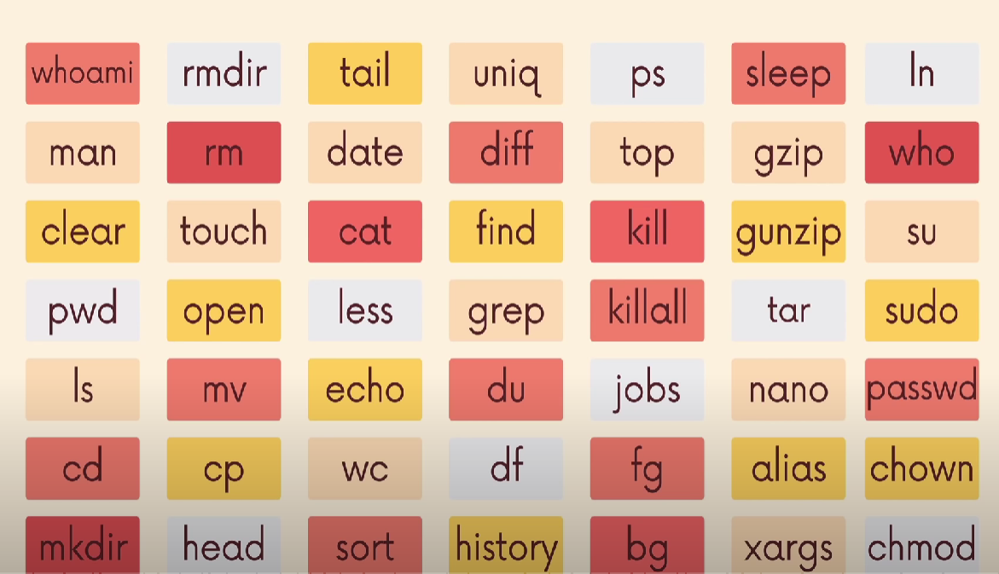

# Introduction Basic Terminal Commands line

- Working within the terminal is common practice for any Backend Developer and there are many commands and utilities that can help you achieve your tasks more efficiently.

- The best way to learn these commands is to practice them in your own machine/environment. Specifically, these are related to Linux commands/utilities which are the most prevalent in the market.

## Basic commands

```js
====   os : window and linux   ====                     
             ::                                                 
            :YY:                                                
           .7JYY:                                               
          :YJJYYY^                                              
         ^YYJ!!JYY~                                             
        !YYY:  :YYY~                                            
      .7Y?7~    ~7?J~.                                          
      ^:.          .^^   

command print console echo example
clean console cls , linux : clear
command : cd 
example : cd folder , linux and window
command : cd .. , linux and window
=> out folder
example : cd.. => out /folder/
make folder => mkdir folder
delete folder => rm -r folder 
show list folder => window : dir , linux : ls

- os linux 
run => sudo command
#Here’s the general syntax : 
~sudo (command)
pwd command
#The pwd command uses the following syntax :
~pwd [option]
cat command
Here are other ways to use the cat command:
~cat > filename.txt creates a new file.
cp command
example : cp filename.txt /home/username/Documents

...

```

## Detail

- Linux Command



  - link : https://www.hostinger.com/tutorials/linux-commands
    - link : https://github.com/ibraheemdev/modern-unix
      - link : https://www.learnenough.com/command-line-tutorial
        - link : https://cmdchallenge.com/
          - link : https://www.youtube.com/watch?v=ZtqBQ68cfJc


